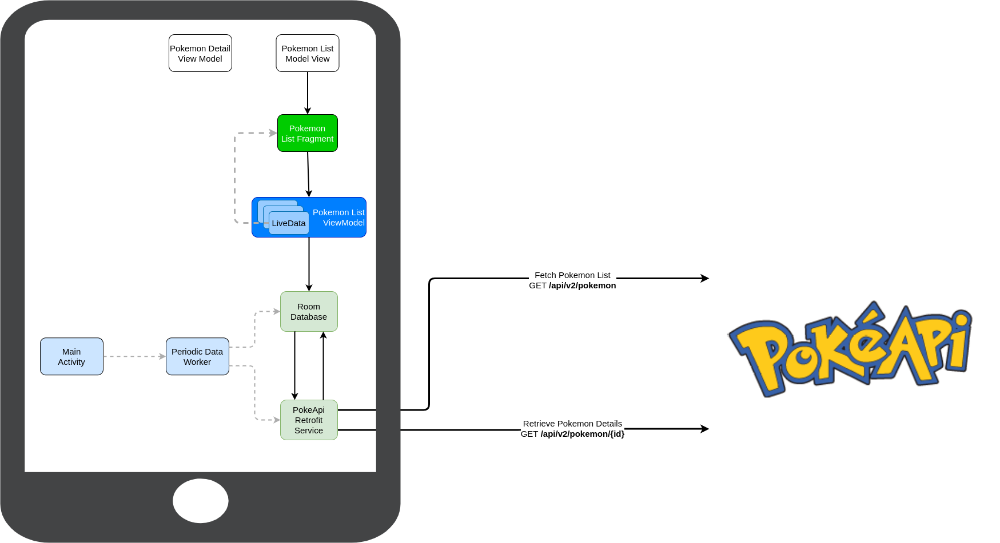
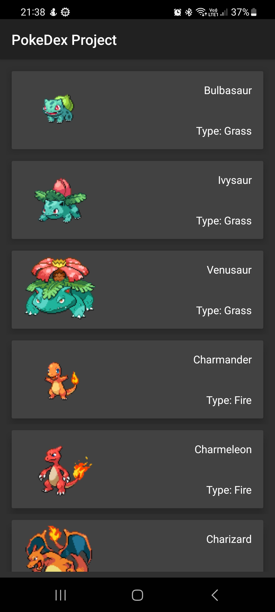
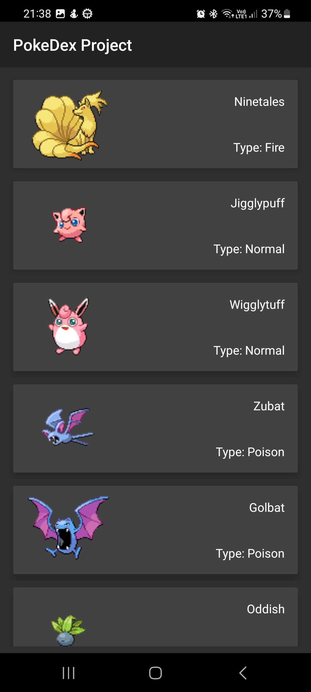
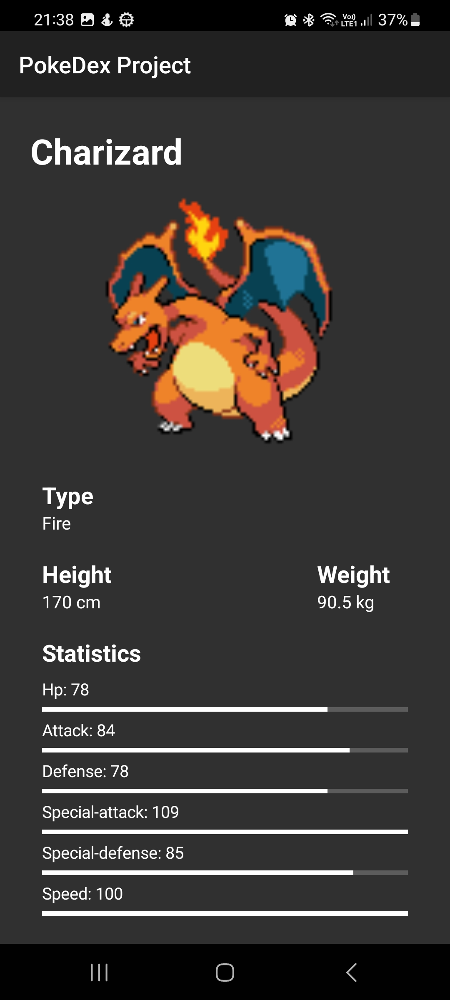
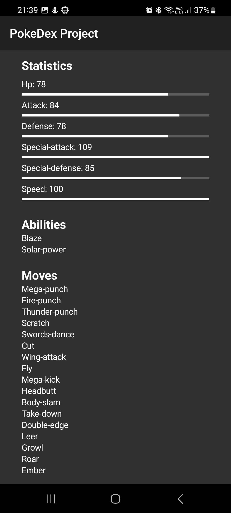
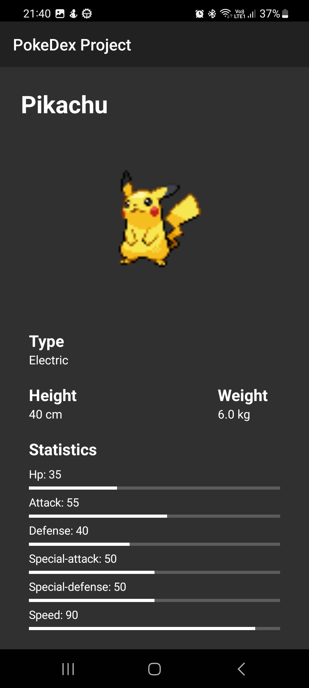
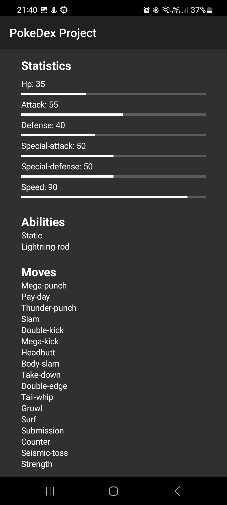

# PokeDex Project
PokeDex project is an Android application for visualising all the pokemon creatures in the Pokemon universe, just like the real
'PokeDex' from the series.

More information can be found on the official [Pokemon Fandom Website](https://pokemon.fandom.com/wiki/Pok%C3%A9dex)

```
The Pokédex (ポケモン図鑑ずかん, Pokemon Zukan, Illustrated Pokémon Encyclopedia) is an electronic device created and designed 
to catalog and provide information regarding the various species of Pokémon featured in the Pokémon video game, anime and 
manga series. The name Pokédex is a neologism including "Pokémon" (which itself is a portmanteau of "pocket" and "monster") 
and "index". The Japanese name is simply "Pokémon Encyclopedia", as it can feature every Pokémon on it, depending on the Pokédex.
```

# Features
The application is very simple. It has two screens:
* A list screen with all the pokemons
    * For each pokemon, the user can see
        * The name
        * The pokemon type
        * An image of the pokemon

* A details screen with complex information about the Pokemon:
    * Name
    * Type
    * Height (in cm)
    * Weight (in kg)
    * The list of abilities
    * The list of moves the Pokemon can use in a battle
    * The stats of the pokemon, such as:
        * HP
        * Attack power
        * Defense
        * Special attack power
        * Special defense power
        * Speed

# High Level Architecture

## PokeApi
The application fetches the information about Pokemons from the [PokeApi](https://pokeapi.co) public API. The API is free to use
and does not require any set of credentials or authentication method.

## Room
The data from PokeApi is cached in memory in case the Android device loses connection and cannot access the newest list of Pokemons
from PokeApi.

The Caching logic uses the Repository pattern presented during the labs.

#### Database Model
The application uses only a single table called `pokemons`.

Only a subset of properties for each Pokemon from PokeApi is cached in the local SQLite database using Room. The properties are
computed based on the API response from PokeApi.

```kotlin
@Entity(tableName = Constants.TABLE_NAME)
data class PokemonEntity constructor(
    @PrimaryKey
    @ColumnInfo(name = "name")
    val name: String,

    @ColumnInfo(name = "api_id")
    val apiId: Int,

    @ColumnInfo(name = "image")
    val image: String,

    @ColumnInfo(name = "type")
    val type: String,

    @ColumnInfo(name = "height")
    val height: Int,

    @ColumnInfo(name = "weight")
    val weight: Int,

    @ColumnInfo(name = "abilities")
    val abilities: List<String>,

    @ColumnInfo(name = "moves")
    val moves: List<String>,

    @ColumnInfo(name = "stats")
    val stats: List<Stat>
    ) 


data class Stat(
    val name: String,
    val baseStat: Int
    )
```

## RecyclerView
The data is displayed in the UI using a RecyclerView, with one card item per each Pokemon.
The name, type and an image of the Pokemon are displayed.

## Repository and WorkManager
The application was implemented following the Repository and periodic WorkManager patterns presented during the labs.

The WorkManager periodically checks for new data from PokeApi using the and saves it in the Room Database using the
Pokemon Repository object.



# Project Structure
* [MainActivity.kt](app/src/main/java/com/example/pokedexproject/MainActivity.kt) is the entrypoint of the application
* The [network](app/src/main/java/com/example/pokedexproject/network) project contains the code required to call the API
    * The Retrofit DAOs & adapters
    * The DTOs for communicating with https://pokeapi.co
    * Helper code to download images from PokeApi using Glide
* The [database](app/src/main/java/com/example/pokedexproject/database) package contains the code for the Room database
    * The Room Kotlin adapters
    * The definition of the Pokemon entity
* [models](app/src/main/java/com/example/pokedexproject/models) contains the definition of the Pokemon entity
* [workers](app/src/main/java/com/example/pokedexproject/workers) contains the Periodic Worker code to be run each 15 minutes
* [fragments](app/src/main/java/com/example/pokedexproject/fragments), [viewmodels](app/src/main/java/com/example/pokedexproject/viewmodels)
  and [adapters](app/src/main/java/com/example/pokedexproject/adapters) contains the definition for the Fragments, ViewModels and Adapters
* [repository](app/src/main/java/com/example/pokedexproject/repository) contains the PokemonRepository class, which binds the Retrofit client
  and the Room database

# ScreenShots
ScreenShot                                                              | ScreenShot                                                              | ScreenShot
:----------------------------------------------------------------------:|:-----------------------------------------------------------------------:|:------------------------------------------------------------------------:
 |  | 
 |  | 
